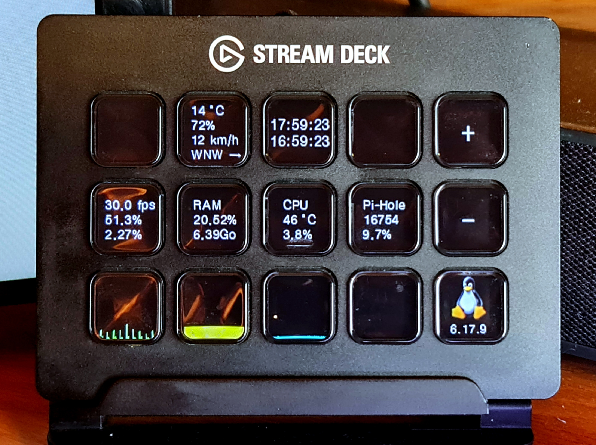

This project is a simple streamdeck controller for my personal use, it requires the python streamdeck module, please check the [official documentation](https://python-elgato-streamdeck.readthedocs.io/en/stable/) for installation instructions...



```
conf/conf.json

{
    "pihole_key": "pihole password",
    "pihole_url": "https://pihole_ip:8443/api",

    "weather_location": "city name"
}
```
